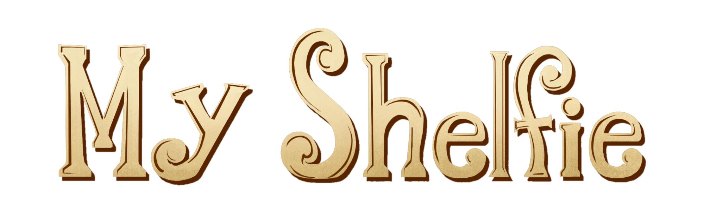

     
    
     

 

     
    Software Engineering Project - Politecnico di Milano (2022-2023)
     

## Project specification
The project consists of a Java version of the board game *MyShelfie*, made by Cranio Creations.

## Implemented functionalities
| Functionality     | Status |
|:------------------|:------:|
| Basic rules       |   🔴   |
| Complete rules    |   🔴   |
| Socket            |   🔴   |
| CLI               |   🔴   |
| GUI               |   🔴   |
| Multiple games    |   🔴   |

🔴 Not Implemented
🟡 Implementing
🟢 Implemented

## Test cases

| Package |Tested Class | Coverage |
|:-----------------------|:------------------|:------------------------------------:|
| Model | | 
| Controller | |

## Team members (AM26)
- Marco Conti
- Davide Corradina
- Flavio De Lellis
- Nicola De March

## Launch
