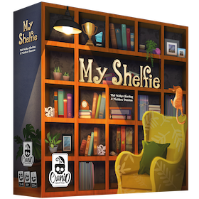

 

    
     
     
    Software Engineering Project - <a href="https://www.polimi.it/">Politecnico di Milano</a> (2022-2023)
     

## Project specification
The project consists of a Java version of the board game *MyShelfie*, made by [_Cranio Creations_].

## Implemented functionalities
| Functionality          | Status                            |
|:-----------------------|:---------------------------------:|
| Basic rules            |      |
| Complete rules         |      |
| TUI                    |      |
| Socket                 |      |
| RMI                    |      |
| Multiple games         |      |
| Persistency            |      |
| Disconnection Handling |      |
| Chat                   |      |

 Implemented

 Not Implemented

## Test cases

| Package     |Tested Class | Coverage    |
|:------------|:------------|:-----------:|
| Model       |             |             |
| Controller  |             |             |

## Team members (AM26)
* [Marco Conti](https://github.com/C0NN)
* [Davide Corradina](https://github.com/CorraPiano)
* [Flavio De Lellis](https://github.com/flaviodelellis)
* [Nicola de March](https://github.com/nicola-de-march)

## Tools and frameworks
* [IntelliJ](https://www.jetbrains.com/idea/): Main IDE for project development.
* [Maven](https://maven.apache.org/): Package and dependency management.

## Launch
...

[_Cranio Creations_]: https://www.craniocreations.it/
